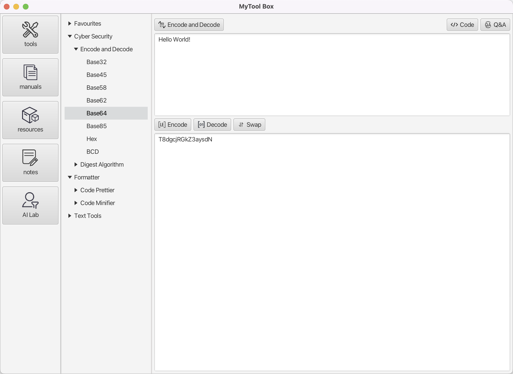

# Mytool Box

The inspiration comes from [LafTools](https://github.com/work7z/LafTools), but I didn't want to use Electron which
includes a full browser, nor deal with the dependency hell of node_module, so I redesigned and implemented it using 
Java and JavaFX.



# Prerequisites

* OpenJDK21：recommended [Liberica Full JDK 21](https://bell-sw.com/pages/downloads/)
* NIK：recommended [Liberica Native Image Kit 23](https://bell-sw.com/pages/downloads/native-image-kit/)
* Maven3.8.x

## Configuration

change `pom.xml` to your own JDK path:

```xml
<properties>
  <openjdk.home>
    /Library/Java/JavaVirtualMachines/openjdk@21.jdk/Contents/Home
  </openjdk.home>
  <nikjdk.home>
    /Library/Java/LibericaNativeImageKit/liberica-vm-full-23.1.2-openjdk21/Contents/Home
  </nikjdk.home>
  <gluon.home>
    /Library/Java/JavaVirtualMachines/graalvm-svm-java17-darwin-gluon-22.1.0.1-Final/Contents/Home
  </gluon.home>
</properties>
```

# Run

Main class:

```
com.mytool.box.MytoolBoxApp.java
```

# Build

## JVM

```shell
./mvnw clean package -P jpackage
```

output: `target/mytool-box.app`

## native

```shell
./mvnw clean package -P native
```

output: `target/mytool-box`

# Other languages

* [中文](docs/README.zh.md)