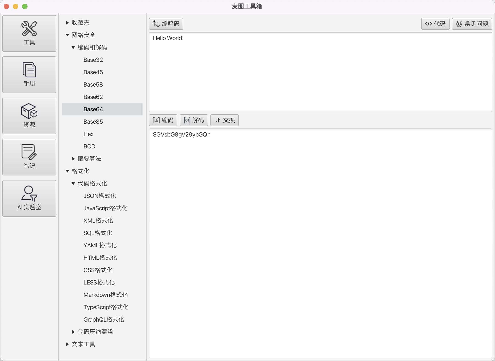

# 麦图工具箱

灵感来自于 [LafTools](https://github.com/work7z/LafTools)，但不想使用包含完整浏览器的Electron以及依赖地狱的node_module，采用Java
和 JavaFX重新设计实现。



# 环境准备

* OpenJDK21：recommended [Liberica Full JDK 21](https://bell-sw.com/pages/downloads/)
* NIK：recommended [Liberica Native Image Kit 23](https://bell-sw.com/pages/downloads/native-image-kit/)
* Maven3.8.x

## 配置

修改 `pom.xml` 为你自己的JDK路径：

```xml

<properties>
  <openjdk.home>
    /Library/Java/JavaVirtualMachines/openjdk@21.jdk/Contents/Home
  </openjdk.home>
  <nikjdk.home>
    /Library/Java/LibericaNativeImageKit/liberica-vm-full-23.1.2-openjdk21/Contents/Home
  </nikjdk.home>
  <gluon.home>
    /Library/Java/JavaVirtualMachines/graalvm-svm-java17-darwin-gluon-22.1.0.1-Final/Contents/Home
  </gluon.home>
</properties>
```

# 运行

主函数:

```
com.mytool.box.MytoolBoxApp.java
```

# 打包

## JVM版本

```shell
./mvnw clean package -P jpackage
```

运行文件: `target/mytool-box.app`

## 原生镜像

```shell
./mvnw clean package -P native
```

运行文件: `target/mytool-box`

# Other languages

* [English](../README.md)